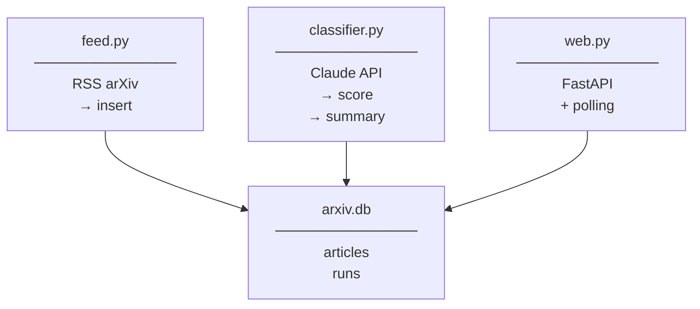

# Arquitetura

## Visão Geral

O arXiv Indexor é uma aplicação Python composta por módulos independentes que se comunicam através de um banco SQLite central.



## Componentes

### `feed.py` — Ingestão de Artigos

Responsável por buscar artigos novos do arXiv via RSS e persistir no banco.

- Itera sobre as categorias em `CATEGORIES`
- Faz `GET` no endpoint `https://rss.arxiv.org/rss/{category}`
- Parseia com `feedparser`
- Insere com `INSERT OR IGNORE` — deduplicação automática por `id` do arXiv
- Retorna `(count_new, new_articles)` — apenas artigos **realmente novos** (não duplicatas)

### `classifier.py` — Classificação e Resumo

Usa o Claude para avaliar relevância e gerar resumos em português.

**Etapa 1 — Scoring (batches de 20 artigos):**
- Busca todos os artigos sem score (`score IS NULL`)
- Envia título + abstract (até 500 chars) em lote pro Claude
- Recebe JSON com `{"id": "...", "score": N}` para cada artigo
- Salva no banco imediatamente após cada batch (incremental)
- Reporta progresso via callback opcional

**Etapa 2 — Resumo (top 5):**
- Seleciona os 5 artigos com maior score do dia
- Envia título + abstract (até 800 chars)
- Recebe 2 frases em pt-BR por artigo
- Salva `summary` no banco

### `db.py` — Persistência

SQLite com WAL mode para concorrência entre o servidor web e tarefas em background.

Ver [database.md](database.md) para o schema completo.

### `web.py` — Interface Web

FastAPI com Jinja2. Dois tipos de endpoints:

**Páginas HTML:**
- `GET /` — artigos de hoje + estimativa de custo
- `GET /history` — histórico
- `GET /status` — última execução + perfil de interesse

**Ações (POST com redirect):**
- `POST /fetch` — dispara indexação RSS em background
- `POST /classify` — dispara classificação IA em background

**API:**
- `GET /progress` — estado da tarefa em execução (JSON)

O estado da tarefa é um dict global `_state` atualizado pela thread de background e lido pelo endpoint `/progress`. O frontend faz polling a cada 1,5 s enquanto `running = True`.

### `mailer.py` — Digest por E-mail

Opcional. Envia HTML com top-5 artigos via SMTP/STARTTLS. Silenciosamente ignorado se `SMTP_*` não estiver configurado.

### `__main__.py` — CLI

Dispatcher simples:

| Comando | Executa                          |
| ------- | -------------------------------- |
| `index` | `feed.fetch_articles()` — sem IA |
| `fetch` | `feed` + `classifier` + `mailer` |
| `serve` | Sobe uvicorn com `web.app`       |

---

## Fluxo de Dados

### `index` (sem IA)

```
arXiv RSS → feedparser → INSERT OR IGNORE → arxiv.db
                                           (score = NULL)
```

### `fetch` / "Classificar com IA"

```
arxiv.db (score IS NULL)
    → Claude API (batch 20)
    → UPDATE score          ← commit incremental por batch
    → Claude API (top 5)
    → UPDATE summary
    → SMTP (opcional)
```

### Interface Web — Progresso

```
Browser → POST /classify
       ← 303 redirect → /
       → GET /progress (polling 1,5s)
       ← {"running": true, "processed": 20, "total": 47, "cost_usd": 0.012}
       → atualiza barra + custo ao vivo
       ← {"done": true}
       → location.reload()
```

---

## Decisões de Design

**Por que SQLite?**
Projeto de uso pessoal com uma única instância. SQLite com WAL mode é suficiente e elimina dependência de servidor de banco.

**Por que separar `index` de `fetch`?**
Indexar artigos não tem custo. Classificar tem. Separar permite ver o que chegou de novo e decidir conscientemente quando gastar créditos.

**Por que commits incrementais no classifier?**
Uma sessão de classificação pode ser interrompida (Ctrl+C, queda de rede, timeout). Com commits por batch, o trabalho já feito é preservado e a próxima execução retoma do ponto onde parou (artigos sem score).

**Por que polling em vez de SSE/WebSocket?**
Simplicidade. O progresso é atualizado a cada 20 artigos (~segundos), não em sub-segundo. Polling a 1,5 s é suficiente e não requer nenhuma infraestrutura adicional.
